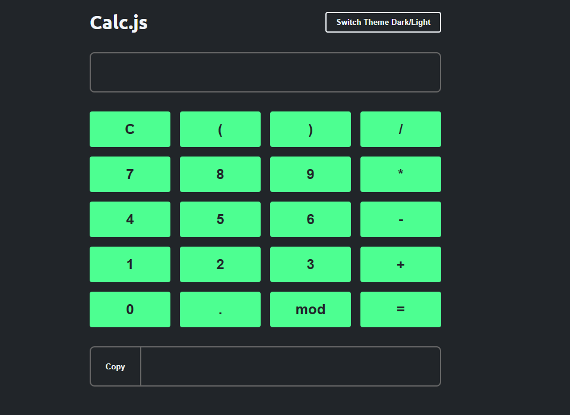

# 🧮 Calc.js - Calculadora Web

Uma calculadora simples e funcional feita com HTML, CSS e JavaScript puro.

  
*(Substitua pela imagem real do seu projeto)*

---

## 🚀 Funcionalidades

- Operações básicas: soma, subtração, multiplicação, divisão e módulo (mod).
- Suporte a expressões com parênteses.
- Exibição de erros em caso de cálculo inválido.
- Copiar o resultado para a área de transferência com um clique.
- Alternância entre temas Dark e Light.

---

## 🛠️ Tecnologias utilizadas

- **HTML5**
- **CSS3**
- **JavaScript Vanilla (puro)**

---

## 🎨 Layout / Estilo

O layout é responsivo e simples, com um sistema de **temas** que permite alternar entre o modo escuro e o modo claro.

### Principais componentes de estilo:

- Design flexível usando **Flexbox** e **Grid Layout**.
- Variáveis CSS para fácil customização de cores.
- Feedback visual para ações como copiar resultado ou erro de cálculo.

---

## 📂 Estrutura do projeto

```
.
├── index.html
├── style.css
└── index.js
```

---

## 💻 Como executar o projeto localmente

1. Clone o repositório:

```bash
git clone https://github.com/seu-usuario/seu-repositorio.git
```

2. Abra o arquivo `index.html` no navegador.

---

## 🎯 Próximas melhorias (ideias)

- Adicionar suporte a teclas do teclado (melhorar o controle de entrada).
- Histórico de cálculos.
- Animações ao alternar o tema.

---

## 📝 Licença

Este projeto está sob a licença MIT.

---

## 📸 Exemplo de uso

> **Digite sua expressão → Clique em "=" → Copie o resultado se quiser.**
